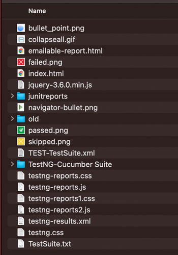
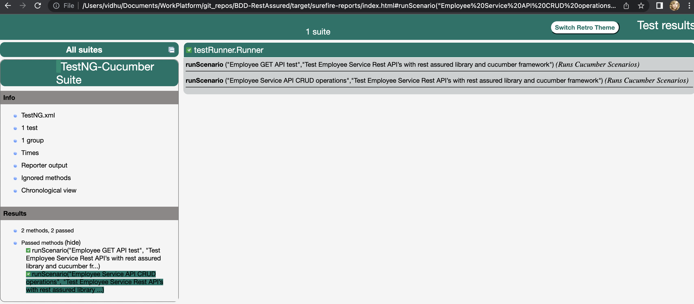

# BDD-RestAssured

<!-- ABOUT THE PROJECT -->
## About The Project

This is a small project to test a REST API employee service (https://dummy.restapiexample.com/) , with the help of BDD Cucumber. 
Internally maven and Rest Assured is used to run the test cases. For creating the Test Suit, following components are used:

* Java
* Maven
* Cucumber BDD
* Rest Assured

<!-- GETTING STARTED -->
## Getting Started

This is an example of how we can set the project locally.
To get a local copy up and running, follow these simple example steps.

### Prerequisites

These things are needed to use the software and how to install them.

* Java:
  The latest or supported Java version need to be installed in the system.
* Maven:
  Maven can be installed in the machine by following:
  [Apache-maven](https://maven.apache.org/install.html)
* Eclipse Java IDE/ IntelliJ IDE (For Development purpose only)
  An IDE to run and test the project need to be setup. The eclipse can be downloaded from [here](https://www.eclipse.org/downloads/)
 

### Installation

Once Java and maven are on place. The process is simple.
1. Clone the repo:
  ```sh
  git clone git@github.com:vidhu-m/BDD-RestAssured.git
  ```
2. Run the below command from inside the project:
  ```sh
  mvn clean test
  ```
  This will show the status of the proect execution. Once the SUCCESS status is seen, go to the next step.
  

  Also, the below command can be used to run specific test cases. 
  Like,
  ```sh
  mvn test -Dcucumber.options="--tags '@RestAPITest'"
   ```
3. Open the project folder and analyse the reports.
   ```sh 
   open target/surefire-reports/
    ```


### Please note that a timer is added in between, since the server provides 429:too many requests error, if more than one request is send in 2 minutes. 





### Additional requirements

* Postman to verify the steps manually.
* IDE requires the below plugins to continue the development of project:
  - Cucumber Editor
  - Maven plugin
  
